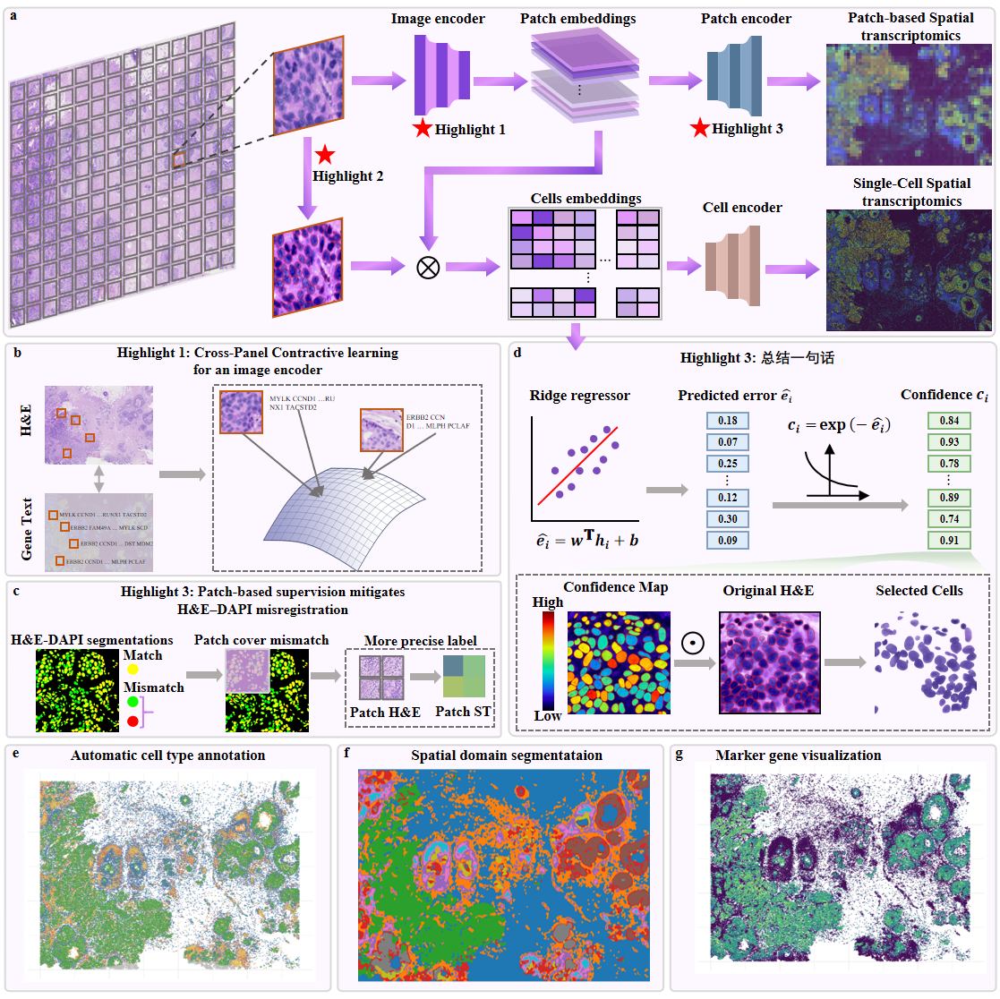

# REGAIN

REGAIN predicts single-cell spatial gene expression directly from H&E-stained
histology images. It first aligns histology and spatial-transcriptomic
representations through contrastive pretraining, then transfers the pretrained
image encoder to a cell-level expression model. The main model jointly uses
cell-level and patch-level supervision to reduce sensitivity to imperfect cell
segmentation and H&E-to-DAPI registration. A Ridge error-regression module
further converts the predicted error into a confidence score for each cell.




## Repository structure

```text
.
|-- REGAIN-pretrain/                 # Cross-modal contrastive pretraining
|   |-- configs/config_demo.json
|   |-- data_demo/
|   |-- model/
|   |-- pretrain.py
|   `-- tutorials/training.ipynb
|-- REGAIN-main/                     # Expression training and inference
|   |-- configs/config_demo.json
|   |-- data_demo/
|   |-- model/
|   |-- ridge_code/
|   |-- tutorials/
|   |-- train.py
|   `-- inference.py
`-- requirements.txt
```

The repository currently contains model-side code and processed demo inputs.
The complete raw-data preprocessing implementation is not included.

## Installation

Linux and an NVIDIA GPU are recommended. The example dependency set was built
with Python 3.10, PyTorch 2.1.1, and CUDA 12.8. If a different CUDA version is
used, install the matching PyTorch and PyTorch Geometric wheels first.

### 1. REGAIN environment

```bash
conda create -n regain python=3.10 -y
conda activate regain
pip install -r requirements.txt
```


**Cellpose environment for data preparation** : REGAIN adopts the data-processing workflow of
[GHIST](https://github.com/SydneyBioX/GHIST), but replaces the original
Hover-Net nucleus-segmentation step with
[Cellpose](https://cellpose.readthedocs.io/en/latest/installation.html).


### 3. Pretraining environment

Contrastive pretraining uses the
[Loki visual-omics foundation model](https://github.com/GuangyuWangLab2021/Loki).
Loki is an external dependency and is not installed by `requirements.txt`. Download the required Loki checkpoint
according to the upstream instructions and set its path in
`REGAIN-pretrain/configs/config_demo.json`.

## Input data

Prepare the following files for each sample:

| File | Description |
|---|---|
| `he_image.tif` | H&E image used by the model |
| `he_image_nuclei_seg.tif` | Cellpose instance mask aligned to the H&E image; background is 0 and each cell has a unique positive ID |
| `matched_nuclei_filtered.csv` | H&E/ST cell correspondence; the demo contains `id_histology`, `id_xenium`, `overlap`, and `size_pix_histology` |
| `cell_gene_matrix_filtered.csv` | Cell-by-gene expression matrix indexed by H&E cell ID |
| `celltype_filtered.csv` | Optional cell-type table indexed by cell ID |


## Usage

Run the stages in the order below. All paths in the JSON files are interpreted
relative to the corresponding `REGAIN-pretrain` or `REGAIN-main` directory.

### 1. Configure contrastive pretraining

Edit `REGAIN-pretrain/configs/config_demo.json`:

- set the H&E, instance-mask, matched-cell, and expression paths;
- set `model.text_model_base_path` to the Loki checkpoint;
- adjust `training`, patch size, overlap, and cell filtering parameters;
- set `comps.celltype` to `true` only when valid cell-type labels are supplied.

Then run the commands in `REGAIN-pretrain/tutorials/training.ipynb` in sequence.

Checkpoints are written to:

```text
REGAIN-pretrain/experiments/<load_dir>/models/contrastive_pretrain/epoch<N>.pth
```

### 2. Transfer the pretrained image encoder

Choose a contrastive checkpoint and copy it to the directory configured by
`constract_train_model_dir` in `REGAIN-main/configs/config_demo.json`. With the
demo configuration, the expected directory is:

```text
REGAIN-main/experiments/constractive_training_weight/models/
```

The checkpoint filename stem is passed through `--constrative_epoch`; for
example, `weight.pth` corresponds to `--constrative_epoch weight`.


### 3. Train the expression model

Edit `REGAIN-main/configs/config_demo.json`, Then run the commands in `REGAIN-main/tutorials/1_training_and_validation.ipynb` in sequence.

The model combines cell-level expression loss with patch-level supervision.
Set `training.patch_loss_weight` to control their balance. If cell types are
available, set `comps.celltype` to `true`, provide `fp_cell_type`, and make
`data.cell_types` match the labels in the table.

Training checkpoints are saved under:

```text
REGAIN-main/experiments/<load_dir>/models/
```

### 4. Validate the model

Run the commands in `REGAIN-main/tutorials/1_training_and_validation.ipynb` in sequence.

Validation outputs are stored in
`experiments/<load_dir>/<val_output_dir>/` and include:

- `epoch_<N>_expr.csv`: predicted expression;
- `epoch_<N>_expr_gt.csv`: ground-truth expression;
- `epoch_<N>_error.csv`: cell-level prediction error;
- `epoch_<N>_embedding.csv`: learned cell embedding.

See `REGAIN-main/tutorials/1_training_and_validation.ipynb`.

### 5. Predict a new sample

Set `data_sources_predict.fp_hist` and `fp_nuc_seg` in the main config. The
instance IDs in the mask become the cell IDs in the output.

Then run the commands in `REGAIN-pretrain/tutorials/2_prediction.ipynb` in sequence.

Prediction files are written to
`experiments/<load_dir>/<predict_output_dir>/`. The demo prediction mode loads
`experiments/demo/models/model.pth`. Update the model path/configuration for a
new experiment. See `REGAIN-main/tutorials/2_prediction.ipynb`.

### 6. Estimate prediction confidence

Open:

```text
REGAIN-main/ridge_code/ridge_train_infer_confidence.ipynb
```

Set the paths to:

- a validation embedding CSV;
- its matched validation error CSV;
- the prediction embedding CSV.

The notebook trains a Ridge model to predict expression error from the learned
embedding, then reports cell confidence as an exponential transformation of
the predicted error. Its default output is
`epoch_demo_predict_confidence.csv`.
